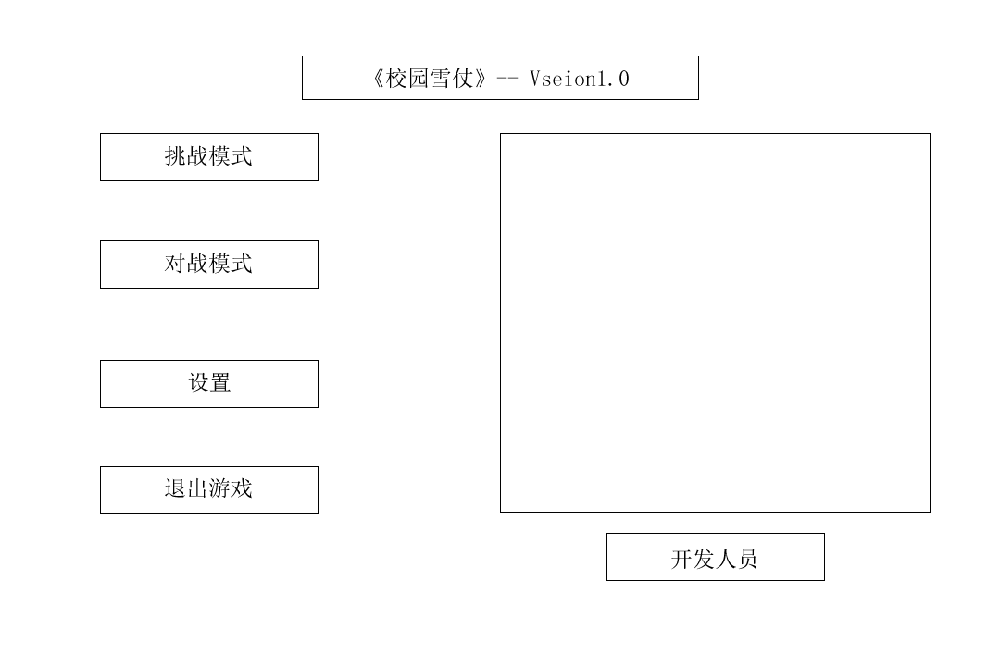
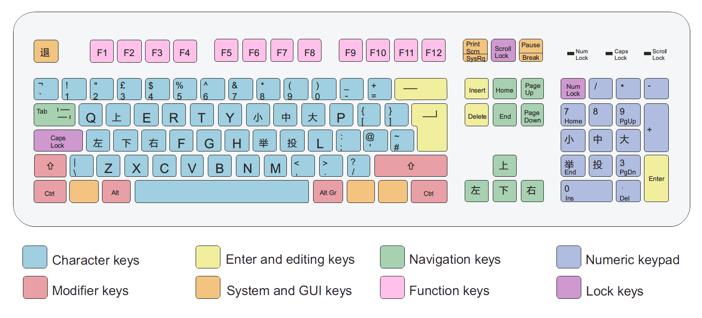

#《校园雪仗》游戏策划书
在农大校园里打雪仗吧！

##Game Overview

###Common Questions

####What is the game?

下雪了，农大学子开心地在校园里打起雪仗来。

####What do I control?

控制自己的学生。

####What is the main focus?

学生要收集在地上的雪，做成雪球扔对手，雪球掉到地上会爆炸，扔到对手无法行动即为胜利。

##Gameplay

###General

玩家收集雪然后扔对手。目前有两种游戏机制，一种是基于 HP 的，一种是基于雪量的。

###Controlling

玩家可以往上、下、左、右、左上、右上、右下、左下这8个方向移动。在普通状态下可以收集雪。使用雪量做成雪球进行投掷。

###Snow System

(HP)随机的地点作为雪块，雪块的位置过一段时间会发生变化，玩家在雪块上可以无限收集雪，玩家被雪球炸到会损失 HP，HP 到 0 即判定为无法行动。

(雪量)天上在下雪，雪地上每个地方雪量不同，会慢慢变大，限定一场游戏的时间。扔雪球会增加被炸到的范围的雪量，从中心往外递减。玩家在普通状态下可以收集四周小范围的雪，降低这个地方的雪量。玩家在雪量大的地方移动速度会减慢。玩家所在处雪量超过阈值移动速度减为 0  即判定为无法行动。（可以延伸出，如果多人游戏，还可以去铲雪救无法行动的队友。）

###Throwing System

投掷雪球会消耗收雪量（已收集的雪量）。可投掷的雪球大小有预设（3种或多种），投掷分为两个阶段：

1. 举起：举起需要花费一点时间，移动速度逐渐减慢，完全举起状态时移动速度不再减慢。减慢的程度与雪球的大小成正比。花费的收雪量与雪球的大小成正比。若收雪量小于预设雪球大小需要的收雪量，则花费所有的收雪量举起相应收雪量大小的雪球。举起状态可以撤销。
2. 投掷：投掷时可以移动，移动速度依旧是慢的，需要蓄力，投掷的距离与蓄力的大小成正比，与雪球的大小成微微反比。蓄力过程中有投掷引导显示出来，具体地为一条投掷轨迹线和投掷范围。若蓄力到最远距离，则停住，无法再远。投掷轨迹呈抛物线，无法控制投掷角度。

雪球：扔的时候会被障碍物挡住，飞的过程中撞到雪球会在空中爆炸，或成功在地面上爆炸，或正中玩家。正中玩家的情况，该玩家会进入晕眩状态（可叠加），持续一段时间，所有操作无法进行。雪球爆炸范围为圆形，范围大小与雪球大小成正比，造成的效果从中心向四周递减，降低在范围内的玩家的 HP 或增加范围内区域的雪量。若有障碍物在爆炸范围内，则障碍物可以挡住爆炸，形成一定范围的空洞，障碍物减少耐久度。

###Obstacles

障碍物为树、楼房（教学楼、店铺）、垃圾桶、汽车、石头。拥有耐久度，耐久度为 0  时破坏殆尽而消失。碰撞体积为圆形（后可以改成不规则多边形）。在游戏过程中会自动出现在地图的随机地方。现设定障碍物覆盖面积约为 30%。

##Data Structure

- 平衡二叉搜索树：障碍物组成（范围树）
- 矩阵：雪量
- 图（最短路径）：怪物寻路
- 线性表：不规则的障碍物碰撞，顶点
- 散列表：目测随手就加进去了

##The World Layout

###Overview

校园的雪地。白色~蓝色表示雪量从小到大。整个背景图片用白色+蓝色的小点的感觉，弄淡点。障碍物随机生成，玩家位置随机，满足两个玩家的距离大于一定的值即可。

###World Layout Detail #1

###World Layout Detail #2

##Game Characters

###Overview

学生。

###Enemies and Monsters

Describe enemies or monsters in the world or whomever the player is trying to defeat. Naturally this depends heavily on your game idea but generally games are about trying to kill something.

##User Interface

###Overview

主体使用简约风格。

###主界面

###关卡选择界面

###成绩界面

###开发人员界面

###游戏界面

###游戏界面热键

##Items

###Overview

道具会随机自动出现在地图上，过一定时间后会消失。

###Weapons Details #1

###Weapons Details #2

##Musical Scores and Sound Effects

###Overview

总体使用欢快轻松的基调。

###Sound Design

- BGM 使用欢快的曲子。
- 玩家移动：在雪上的脚步声。
- 扔雪球：投掷声。
- 雪球爆炸：松脆的声音。

##Single-Player Game

###Overview

在校园里用雪球打怪。

###Single Player Game Detail #1

###Single Player Game Detail #2

###Story

Describe your story idea here and then refer them to an appendix or separate document which provides all the details on the story if it is really big.

###Hours of Gameplay

一关 5 分钟。

###Victory Conditions

怪物全打掉。

##Multiplayer Game

###Overview

扔雪球使对手变为无法行动的状态。

###Max Players

2（联机或者可以更多）。

###Customization

Describe how the players can customize the multiplayer experience.

##Character Rendering

###Overview

角色根据颜色区分不同玩家，有八种朝向，分为 3 种基本状态：

- 站立
- 移动
- 无法行动（死亡）

并有 5 种扩展状态：

- 举雪球
- 扔雪球
- 被雪球波及到
- 被雪球正中
- 晕眩

###Character Rendering Detail #1

###Character Rendering Detail #2

##Extra Miscellaneous Stuff

###Overview

Drop anything you are working on and don’t have a good home for here.

###Junk I am working on…

Crazy idea #1

Crazy idea #2
